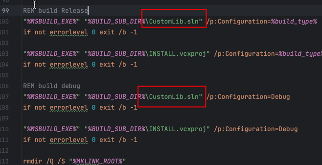

### 目录解析
config			脚本编译及打包选项
depends			脚本编译依赖(脚本,资源...)
jenkins			Jenkins打包脚本, 由Jenkins直接执行
local			本地打包脚本目录(自动指定打包目录及打包参数)
macos			mac编译及打包脚本
windows			windows编译及打包脚本

### install
- 编译后的库默认会生成在install目录下
```txt
install/
        macos/
            include/
            shared/
                  framework
            static/
                  framework
        windows/
              include/
              x64/
                shared/
                      debug/
                        xxx.lib xxx.dll xxx.pdb
                      release/
                        xxx.lib xxx.dll xxx.pdb
                static/
                    debug/
                        xxx.lib
                    release/
                        xxx.lib
```

### 那么如何配置如何实现自动化打包呢
- 1、修改 builder_local/config/config.sh 文件中的参数
- 2、修改 builder_local/depends/git.deploy.config.bat 文件中的发布仓库地址
- 3、修改 builder_local/depends/git.deploy.config.sh 文件中的发布仓库地址
- 4、修改 builder_local/windows/windows.build64.bat 的sln解决方案名称


- 5、到apollo编译平台中增加对应的项目